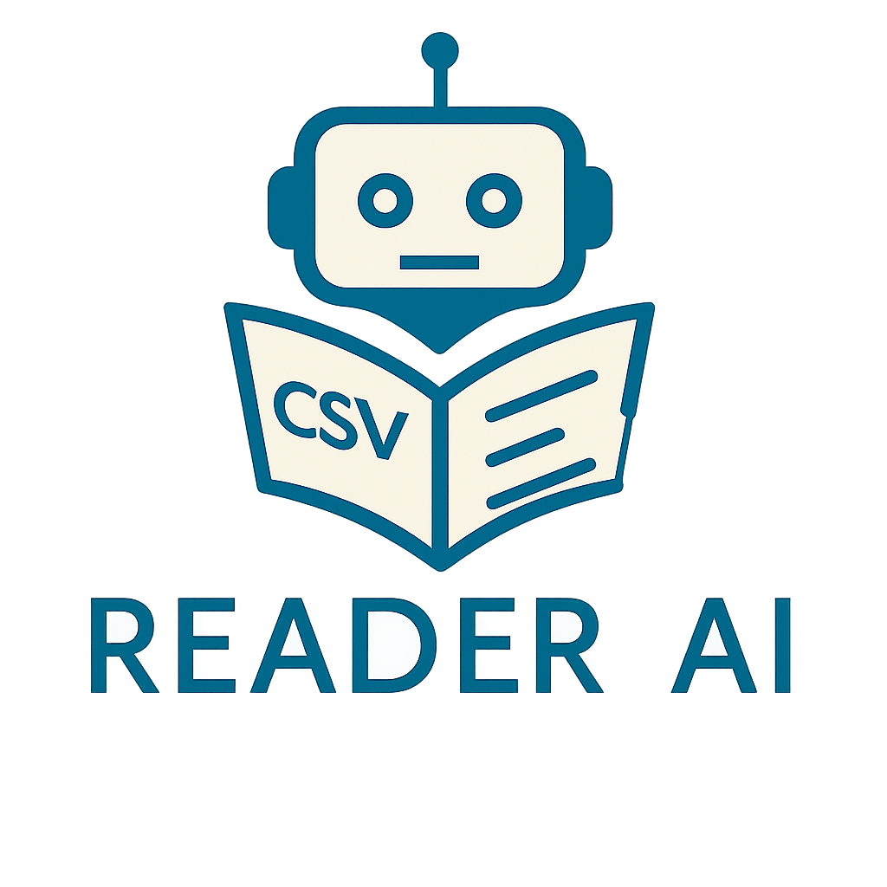
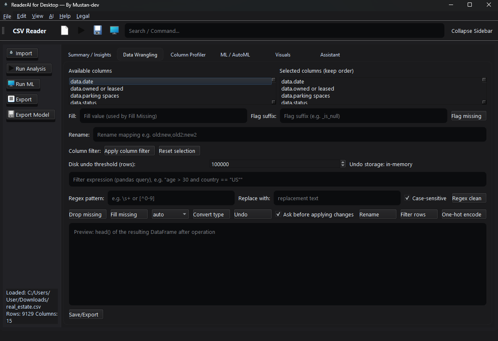
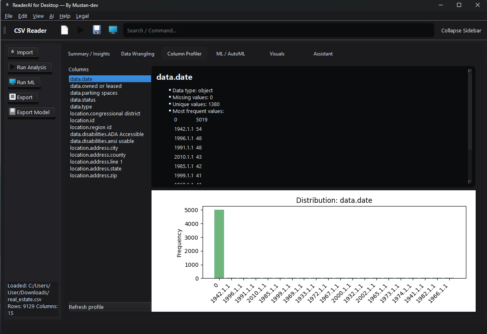
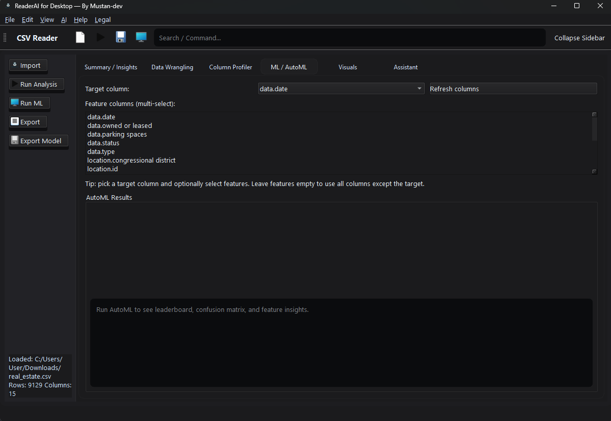
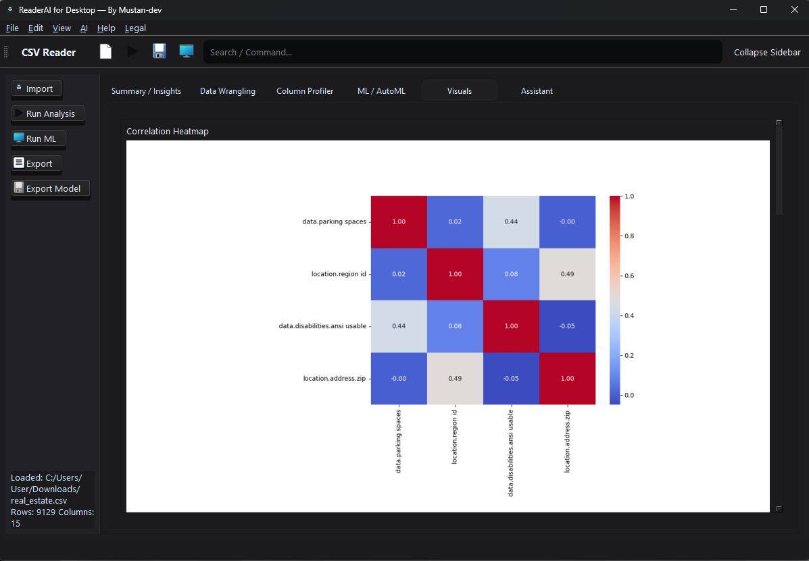
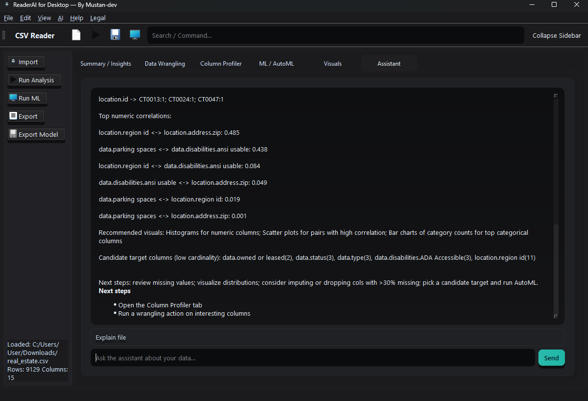

# Desktop App Reader AI

Desktop App Reader AI is a Windows desktop application powered by AI that reads text for you. Perfect for accessibility, studying, or productivity.

---

## Features
- Converts text to speech quickly and accurately
- User-friendly interface
- Portable version available (no installation required)

---

## Website
For more information, updates, or support, visit: [mustan-dev.web.app](https://mustan-dev.web.app/)

---
í
## Download
### Latest Release:
- [Installer (ReaderAI_Setup.exe)](https://github.com/Mustan-dev/Desktop-App-Reader-AI/raw/refs/heads/main/Releases/ReaderAI_Setup.exe)
- [Portable ZIP version](https://github.com/Mustan-dev/Desktop-App-Reader-AI/raw/refs/heads/main/Releases/DesktopAppReaderAI_Portable.zip)

Or download directly from our website: [Download from Website](https://mustan-dev.web.app/download)

---

## Screenshots

### 1. Summary / Insights

### 2. Data Wrangling

### 3. Column Profiler

### 4. ML / AutoML

### 5. Visuals

### 6. Assistant

---

## License
© 2025 Mustan Aliev. All Rights Reserved.  
This software is for personal use only. Redistribution, modification, or commercial use is strictly prohibited.

---

## Contact
For questions or support, contact: [Mustan1999@icloud.com](mailto:Mustan1999@icloud.com)
